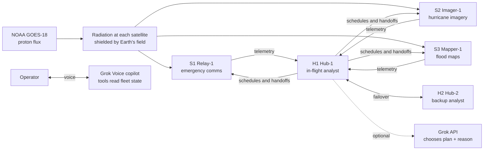

# Lifeline

**Keeping critical satellite services running through solar storms.**

When a solar storm hits and the ground can't keep up, Lifeline lets the satellites that can think protect the ones that can't.

Built with **Cursor**, using the **Grok API** (the in-flight analyst and mission debrief), **Grok Voice** (a live operator copilot and the video narration), and **Grok Imagine** (the solar storm visuals in the demo video).

▶ **Demo video:** [`video/Lifeline_demo.mp4`](video/Lifeline_demo.mp4) (3:26, 1080p)


---

## Contents

1. [The problem](#the-problem)
2. [The solution](#the-solution)
3. [How Grok is used](#how-grok-is-used)
4. [Feature tour](#feature-tour)
5. [Results](#results)
6. [Quick start](#quick-start)
7. [Using the dashboard](#using-the-dashboard)
8. [How the simulation works](#how-the-simulation-works)
9. [Architecture and code map](#architecture-and-code-map)
10. [API reference](#api-reference)
11. [Grok Voice copilot internals](#grok-voice-copilot-internals)
12. [Testing](#testing)
13. [Demo video pipeline](#demo-video-pipeline)
14. [Data provenance](#data-provenance)
15. [What is measured and what is simulated](#what-is-measured-and-what-is-simulated)
16. [Limitations and future work](#limitations-and-future-work)

---

## The problem

Satellites keep critical services running on Earth: communications, disaster imagery, navigation, and weather. They matter most in a crisis.

On **9 October 2024**, Hurricane Milton made landfall in Florida. That same morning an **X1.8 solar flare** launched a radiation storm, and proton flux crossed NOAA's S1 threshold within hours. Responders depend on satellite services at exactly the moment space weather puts them at risk.

Most satellites, especially the small ones launched by companies and universities, are poorly equipped for that moment:

| Limitation | Why it matters in a storm |
|---|---|
| **Small, commercial processors** | Radiation causes bit flips and resets. There is no spare compute to analyze a storm. |
| **Minutes of ground contact per pass** | A low-orbit satellite sees a ground station for about 5–10 minutes, a few times a day. |
| **One built-in defense** | Shut down into safe mode, then wait for the ground. |
| **No foresight** | They can't forecast who will be exposed next or decide which services must keep running. |

Ground-based decisions arrive late or not at all, and isolated fixed-threshold rules react only after the radiation arrives.

## The solution

Lifeline is a cooperative, in-flight protection system:

- **In-flight analysis.** A few compute-capable **hub** satellites collect radiation readings and memory-error telemetry from the fleet over crosslinks. Satellites currently over a polar cap measure the unshielded (ambient) radiation, and the hubs combine that with every satellite's **planned orbit** to forecast exposure for the next orbit.
- **Early warning.** Each satellite receives its own **protective schedule** (when to checkpoint and pause) before the radiation reaches it.
- **Protection.** Simple satellites carry out predefined responses: checkpoint, pause through the forecast exposure, and resume as soon as it passes. **Critical services are handed to shielded peers**, emergency comms first.
- **Coordinated recovery.** After the all-clear, services return to their home satellites.
- **Resilience.** A backup hub takes over if the primary is paused. Simple satellites fall back to fixed rules if they stop hearing from any hub.



## How Grok is used

| Grok product | Role in Lifeline | Where |
|---|---|---|
| **Grok API** (chat) | **In-flight analyst.** When a service is at risk, Grok receives the candidate plans with forecast outcomes (downtime in minutes, lost-work risk, interlock risk) and picks one with a plain-language reason. A choice runs only if it matches a validated candidate; otherwise the deterministic analyst decides. | [`backend/grok.py`](backend/grok.py) `analyst_choice`, [`backend/sim.py`](backend/sim.py) `_analyze` |
| **Grok API** (chat) | **Morning-after debrief** for operators and emergency coordinators, written only from the simulator's numbers. | `debrief`, `POST /api/debrief` |
| **Grok Voice** (realtime) | **Operator copilot.** It announces fleet events during playback and answers questions using six client-side tools that read the replay state. It can also play, pause, and jump to decisions. | [`web/voice.js`](web/voice.js), `voiceTools()` in [`web/app.js`](web/app.js) |
| **Grok Voice** (force message) | **Narration** of the demo video, in the "Rex" voice; the copilot speaks as "Eve". | [`video/tts.py`](video/tts.py) |
| **Grok Imagine** (video) | Solar flare, magnetosphere impact, and constellation-over-hurricane clips in the demo video. | `video/imagine_*.mp4` |

The Grok analyst and copilot are **remote API calls standing in for onboard reasoning**, and the UI labels them that way. Scores always come from the simulator, never from a model.

## Feature tour

### Mission context and replay timeline
Every storm opens with a dated, sourced banner and a what-if disclaimer. The timeline plots the measured GOES-18 proton flux on the simulator's risk scale, with the cautious, hold, and interlock levels marked. A fainter trace shows the polar relay satellite's own reading, which spikes on every polar-cap pass. Green ticks mark Lifeline handoffs; amber ticks mark storm alerts, analyst takeovers, and all-clears. Click the chart or use the arrow keys (Shift for 12 steps) to seek.

### Fleet map and decision card


- **Map.** The ground track shades the polar caps where solar protons reach low orbit, brighter as the storm grows. Each satellite shows its trail, its current services, and a red outline when exposed. A dashed ring marks the hub currently acting as analyst. Lines are Lifeline crosslink messages delivered on this step: dashed for schedules, solid green for handoffs. Ground stations (Svalbard, Fairbanks, Atlanta) are marked.
- **Decision card.** It shows the latest Lifeline decision, most critical service first: who decided (analyst hub or Grok), the reason, and every option compared, with forecast downtime and lost-work risk.

### Four fleets, one storm


The same storm hits four fleets side by side, each showing every satellite's live mode and services. The scoreboard (emergency-comms deadlines missed, all deadlines missed, downtime, lost work, interlocks) highlights the best value in green.

### Copilot (Grok Voice)
- **Connect Grok Voice** opens a realtime session. Turn the mic on to talk, or type in the box; typed questions go through the same voice session.
- With *Announce Lifeline decisions* on, each storm alert, handoff, takeover, and all-clear is spoken as playback reaches it.
- Tool calls appear in the transcript ("Grok checked get latest decision"), so you can see what Grok looked at.

### Grok as in-flight analyst
Tick **Grok as in-flight analyst** to re-run the replay with Grok choosing among the validated plans. The status bar shows how many decisions Grok made and the latency, and the decision card labels them "Grok in-flight analyst".

### Stress controls
- **Crosslink delay:** 5–30 minutes.
- **Link loss:** 0–50%, where every message has an independent chance of being dropped.
- **Seed:** noise, telemetry, link, and fault draws.

With 100% loss, Lifeline degrades to fixed rules; that case is covered by a test.

### Evaluation across storms


Every storm runs with five seeds for all four strategies under identical conditions. Headline tiles compare Lifeline with fixed-threshold protection, and the table gives per-storm results.

### Morning-after debrief
**Write with Grok** produces a four-paragraph report: the situation, what Lifeline did and when, how it compared, and one limitation. It is written only from the simulator's facts.

## Results

Five seeds per storm, default settings (5-minute crosslink delay, no link loss), all four strategies under identical conditions. Reproduce with `POST /api/evaluate` or the "Every storm" panel.

**Totals over the five storm windows** (quiet control excluded):

| | Ground-dependent | Fixed-threshold | Hubs only, no sharing | **Lifeline** |
|---|---|---|---|---|
| Emergency comms deadlines missed | 187.8 | 109.0 | 109.0 | **4.4** |
| All service deadlines missed | 308.2 | 173.6 | 173.6 | **8.2** |
| Service downtime | 427 h | 214 h | 214 h | **32 h** |
| Lost work (units) | 56.3 | 99.2 | 106.7 | **40.4** |
| Hardware interlocks | 1.0 | 18.2 | 19.2 | **0** |

Compared with fixed-threshold protection, Lifeline has **96% fewer missed emergency-comms deadlines**, **95% fewer missed deadlines overall**, **85% less downtime**, **59% less lost work**, and **no hardware interlocks**.

**Per storm** (per run: emergency-comms / all deadlines missed · downtime):

| Storm | Ground-dependent | Fixed-threshold | Hubs only | **Lifeline** |
|---|---|---|---|---|
| Oct 8–12, 2024 · Hurricane Milton (S3) | 41.0 / 69.0 · 97.0 h | 36.0 / 58.0 · 67.1 h | 36.0 / 58.0 · 67.1 h | **2.0 / 2.0 · 10.4 h** |
| May 9–13, 2024 · Gannon storm (S2) | 13.2 / 20.6 · 28.2 h | 2.2 / 2.4 · 8.3 h | 2.2 / 2.4 · 8.3 h | **0.0 / 0.0 · 0.7 h** |
| Mar 22–25, 2024 (S2) | 47.8 / 76.2 · 103.8 h | 27.4 / 42.2 · 48.8 h | 27.4 / 42.2 · 48.8 h | **0.2 / 0.6 · 5.9 h** |
| Jun 7–10, 2024 (S3) | 36.8 / 55.4 · 73.4 h | 16.0 / 25.4 · 31.2 h | 16.0 / 25.4 · 31.2 h | **0.0 / 0.0 · 3.2 h** |
| Jan 17–22, 2026 · S4 stress test | 49.0 / 87.0 · 124.8 h | 27.4 / 45.6 · 58.1 h | 27.4 / 45.6 · 58.1 h | **2.2 / 5.6 · 11.6 h** |
| Jul 18–22, 2024 · quiet control | 0 / 0 · 0 h | 0 / 0 · 0 h | 0 / 0 · 0 h | 0 / 0 · 0 h |

**Reading these honestly.**
- **The gain comes from sharing.** "Hubs only, no sharing" gives hubs the same forecasting but shares nothing, and it scores the same as the fixed threshold. The value comes from sharing the analysis, not from having capable satellites.
- **There is a cost.** In the quiet control every strategy delivers every task, and Lifeline's hub analysis costs about 4% of background archive throughput.
- **The S4 storm is the hardest case.** Even shielded orbits are exposed, so Lifeline still misses 5.6 deadlines per run and its mean time to restore rises to about 35 minutes.
- **Ground-dependent loses little work but waits hours.** Its satellites stop computing in safe mode, so little work is lost, but services wait hours for a station pass.
- **The model helps forecasting.** Exposure is a deterministic function of orbit in this simulator; real radiation has more spatial and temporal structure. See [limitations](#limitations-and-future-work).

## Quick start

Requirements: Python 3.11+ (developed on 3.14) and an xAI API key for the Grok features. Everything else works without a key.

```bash
git clone <this repo> && cd GT_hack
python3 -m venv .venv
.venv/bin/pip install -r requirements.txt
cp .env.example .env          # then set XAI_API_KEY=...
.venv/bin/uvicorn backend.app:app --host 127.0.0.1 --port 8010
```

Open **http://127.0.0.1:8010**. The Milton week loads by default. The first load precomputes the replay and the five-seed evaluation in the background (about 10 seconds); after that, results are cached in memory.

`.env` settings:

| Variable | Required | Purpose |
|---|---|---|
| `XAI_API_KEY` | For Grok features | Grok analyst, Grok Voice sessions, debrief. The server keeps it; browsers only get short-lived voice tokens. |
| `XAI_MODEL` | No (default `grok-4`) | Chat model for the analyst and the debrief. |

Without a key, the Grok controls are disabled and the deterministic analyst runs everything.

## Using the dashboard

A good demo path:

1. Open `http://127.0.0.1:8010/#t=370`. The `#t=` fragment jumps to a replay step; there are 12 steps per hour.
2. Press **Next Lifeline decision →**. You'll see the storm alert, then **Hand Emergency comms from S1 to H1** with its options.
3. Press **Play** at 5×, and watch the crosslink lines and the four fleets diverge.
4. Click **Connect Grok Voice**, allow the microphone, turn **Mic** on, and ask:
   - "What's happening right now?"
   - "Why did emergency comms move to Hub-1?"
   - "What if we had done nothing?"
   - "Compare the four strategies."
   - "Jump to the next decision."
5. Tick **Grok as in-flight analyst** and step through the decisions again.
6. Scroll to **Every storm** for the evaluation, then **Write with Grok** for the debrief.

Controls:

| Control | Effect |
|---|---|
| Storm | One of five NOAA storm windows or the quiet control |
| Crosslink delay | Message delivery delay, 1–6 steps (5–30 min) |
| Link loss | Independent drop probability per message, 0–50% |
| Seed | Sensor noise, telemetry, link-loss, and fault draws |
| Grok as in-flight analyst | Re-runs the replay with Grok choosing handoff plans (up to 3 calls) |
| Play / 1× 2× 5× | Playback at 6, 12, or 30 steps per second |
| Next Lifeline decision | Jumps to the next storm alert, handoff, takeover, return, or all-clear |

## How the simulation works

### Fleet

| Satellite | Role | Orbit | Service (priority) |
|---|---|---|---|
| **H1 Hub-1** | Hub, primary analyst | 30°, shielded by Earth's field | Safe harbor for handed-off services |
| **H2 Hub-2** | Hub, backup analyst | 53° | Takes over when H1 is paused or silent |
| **S1 Relay-1** | Simple | 86.4° polar (Iridium-like) | Emergency comms relay (**critical**) |
| **S2 Imager-1** | Simple | 97.4° sun-synchronous | Hurricane imagery processing (essential) |
| **S3 Mapper-1** | Simple | 53° | Flood-mapping inference (essential) |

Every satellite also runs best-effort **archive** work that soaks up spare capacity.

### Radiation exposure
GOES-18 sits outside the magnetosphere, so its flux stands for the unshielded level. Orbits are circular (inclination, period, ascending node, phase). A **tilted geomagnetic dipole** gives each position a magnetic latitude, and exposure ramps from 0.4% below 55° to 100% above 63°, averaged over each 5-minute step. The polar satellites cross a cap for 15–20 minutes twice per orbit, and H1 is effectively always shielded.

Flux maps to a 0–1 **risk scale**: 10 pfu (S1) stays below *cautious* (0.35), 100 pfu (S2) meets *hold* (0.55), and 1,000 pfu (S3) meets the *hardware interlock* (0.72).

### Local readings
Each satellite combines two sources:
- a particle sensor with noise σ = 0.04, whose confidence comes from the archive's quality flags (0 during data gaps)
- a Poisson memory-error count with rate 12 × risk², smoothed into a hardware estimate

The two are blended by confidence, so a sensor gap doesn't blind the satellite.

### Workload
- **Emergency comms** releases a 25-minute task every hour, due within the hour.
- **Imagery** and **flood maps** release 50-minute tasks every 2 hours.
- Scheduling is critical first, then earliest deadline first, then archive work.
- A completed task commits its result. Otherwise, progress survives only past a checkpoint.

### Faults
- While a payload is active (computing or checkpointing), each step has hit probability **risk² × 0.03**. A hit loses unsaved work.
- Safe mode powers the payload down, so unsaved work is lost unless it was checkpointed first.
- A **hardware interlock** forces safe mode at true risk ≥ 0.72; no controller can override it.

### The four strategies
All four fleets share one storm, one set of orbits, and the same noise, telemetry, link-loss, and fault draws. Only the strategy differs.

| Strategy | Behavior |
|---|---|
| **Ground-dependent** | Onboard safe mode only. Ground stations (Svalbard, Fairbanks, Atlanta; contact within 18° of arc) read telemetry during passes. After 30 minutes of analysis, they uplink commands (hold, cautious, resume) on a later pass. Interlocked satellites wait for a ground resume. |
| **Fixed-threshold** | Each satellite reacts to its own sensor: cautious at 0.35, checkpoint-then-hold at 0.55, resume after 3 quiet steps below 0.28. |
| **Hubs only, no sharing** | Hubs forecast and protect themselves; simple satellites keep fixed rules. Nothing is shared. |
| **Lifeline** | Hubs analyze the whole fleet, send schedules and handoffs, fail over, and support fallback, as described below. |

### Lifeline's in-flight analyst
Each step, the active hub:
1. **Updates the ambient estimate** from any report whose satellite is at least 60% exposed: `ambient = risk(flux_reading / exposure)`. The estimate is kept for up to 2 hours.
2. **Forecasts exposure windows** for every satellite over the next orbit (19 steps): the contiguous steps where `risk(ambient_flux × planned_exposure) ≥ 0.55`.
3. **Sends schedules** to each simple satellite when its windows change, and every 15 minutes regardless, for robustness to loss.
4. **Plans services.** During a storm (ambient ≥ 0.45), for each service whose host has a forecast window, it builds candidates:
   - *stay*: checkpoint and pause through each window
   - *no-action*: rely on built-in rules; shown for comparison, never executed
   - *move:X*: hand off to any peer with capacity whose forecast peak stays below 0.35

   Candidates are scored as `tier_weight × downtime + lost_risk + 10 × interlock_risk`, with critical weighted 3 and essential 1. A move must beat staying by a margin. Grok can make this choice when enabled.
5. **Returns services home** once ambient is back below 0.28 and the home satellite is running, has capacity, and is forecast clear.
6. **Announces** storm detection, analyst takeovers, and all-clears.

Simple satellites follow their schedule: they checkpoint and pause the step before a forecast window and resume as soon as it passes. They carry out handoffs (checkpoint, then transfer), always pause locally if their own reading reaches the hold level, and fall back to fixed rules after 60 minutes without a hub message.

### Messaging
Crosslink messages are `report` (every satellite to each hub, every step), `schedule`, `handoff`, and `return`. Each is delivered after the configured delay, and each can be dropped by an independent, seeded draw. The analyst uses **only delivered messages plus planned orbits**; it never sees true risk or future samples.

### Metrics

| Metric | Definition |
|---|---|
| Emergency comms deadlines missed | Critical relay tasks not finished by their deadline |
| All service deadlines missed | Tasks missed across all three services |
| Service downtime | Steps an essential service spent not running on an active payload (×5 min) |
| Mean time to restore | Average length of those interruptions |
| Lost work | Unsaved progress destroyed by faults or power-downs |
| Hardware interlocks | Forced safe-mode trips at risk ≥ 0.72 |
| Handoffs | Service transfers started |
| Archive | Best-effort work completed |

### Key parameters ([`backend/fleet.py`](backend/fleet.py), [`backend/analyst.py`](backend/analyst.py))

| Parameter | Value | Meaning |
|---|---|---|
| `CAUTIOUS` / `HOLD` / `CLEAR` / `SAFETY_LIMIT` | 0.35 / 0.55 / 0.28 / 0.72 | Risk thresholds |
| `HORIZON` | 19 steps | Forecast horizon (about one orbit) |
| `CHECKPOINT_STEPS`, `TRANSFER_STEPS` | 1, 1 | Five minutes each |
| `RECOVER_STEPS` / `RECOVER_PLANNED` | 2 / 1 | Health check after an unplanned or planned pause |
| `RESUME_STREAK` | 3 | Quiet steps before fixed rules resume |
| `NORMAL_` / `CAUTIOUS_CHECKPOINT_EVERY` | 12 / 4 | Periodic checkpoint interval |
| `GROUND_ANALYSIS_STEPS` | 6 | Ground turnaround (30 min) |
| `FALLBACK_AFTER` | 12 | Silence before a simple satellite uses fixed rules |
| `ANALYST_LOAD` | 0.15 | Compute the active hub spends on analysis |
| `SERVICE_CAPACITY` | 0.95 | Maximum service load per satellite |
| `HIT_SCALE` | 0.03 | Fault probability scale |
| `STORM_LEVEL` / `AMBIENT_MEMORY` / `MOVE_MARGIN` | 0.45 / 24 / 2.0 | Analyst settings |

## Architecture and code map

```
GT_hack/
├── backend/
│   ├── app.py        FastAPI app: endpoints, caching, gzip, startup warm-up, debrief facts
│   ├── space.py      NOAA replay loading, missions, orbits, dipole exposure, ground contact, risk scale
│   ├── fleet.py      Satellites, roles, services, thresholds, durations
│   ├── analyst.py    Ambient estimate, exposure windows, candidate plans, scoring, explanations
│   ├── sim.py        Environment draws, fleet state, four controllers, crosslinks, execution, scores, evaluation
│   └── grok.py       Grok API: analyst choice, debrief, realtime client secrets
├── web/
│   ├── index.html    Dashboard layout
│   ├── styles.css    Dark theme, responsive grid
│   ├── app.js        Replay, chart, map, fleets, evaluation, copilot tools, debrief
│   └── voice.js      Grok Voice realtime client (24 kHz PCM in and out, tools, barge-in)
├── data/noaa/        GOES-18 fixtures (JSON) + manifest
├── scripts/extract_noaa.py   Rebuilds fixtures from NCEI NetCDF files
├── tests/test_lifeline.py    12 tests
├── video/            Demo video, narration script, recording and assembly scripts, Imagine clips
├── docs/             README screenshots
└── archive/          Previous version (lifeline-v1.tar.gz)
```

Each run is request-local and deterministic for a given (storm, seed, delay, loss). The server caches recent runs and evaluations with `functools.lru_cache`, and responses are gzip-compressed (a full Milton replay is about 5 MB raw, about 200 KB compressed).

## API reference

All `POST` bodies share one schema. Every field is optional:

```json
{ "window": "oct2024", "seed": 7, "latency": 1, "loss": 0.0, "grok": false }
```

`window` is one of `oct2024`, `may2024`, `mar2024`, `jun2024`, `jan2026`, or `quiet2024`. `seed` is 1–99; `latency` is 1–6 steps; `loss` is 0–0.6.

| Endpoint | Returns |
|---|---|
| `GET /` | The dashboard |
| `GET /api/events` | Storm windows (label, dates, peak, catalog check, mission story) and `grok` (whether a key is set) |
| `POST /api/run` | One replay: `frames` (one per 5-minute step), `decisions`, `summary`, `mission`, `satellites`, `services`, `logs`, `messages`, `advisorCalls`. With `grok: true` and a key, Grok acts as analyst. |
| `POST /api/evaluate` | Five seeds × every storm for the given `latency` and `loss`: `rows[].scores[strategy]` and `headline` (totals and % change vs each baseline). Cached. |
| `POST /api/voice/session` | `{token, expiresAt, url, model}`, a 10-minute Grok Voice client secret. Returns 503 without a key. |
| `POST /api/debrief` | `{text, latencyMs, model, facts}`. The Grok-written report and the exact facts it was given. |

Each frame contains:
- `sats[id]`: fused risk, true risk, exposure, latitude and longitude, error count, and ground contact
- `fleets[strategy]`: each satellite's mode label, tone, and services; the running scores; and the active analyst
- `links`: Lifeline crosslink messages delivered on that step

## Grok Voice copilot internals

1. The browser calls `POST /api/voice/session`. The server mints a short-lived client secret with `POST https://api.x.ai/v1/realtime/client_secrets`, so the API key never reaches the browser.
2. The browser opens `wss://api.x.ai/v1/realtime?model=grok-voice-latest` with the subprotocol `xai-client-secret.<token>`, then sends `session.update` with the copilot instructions, voice `eve`, server voice-activity detection, 24 kHz PCM in and out, and the tools.
3. Microphone audio is captured by an AudioWorklet, converted to 16-bit PCM, and streamed as `input_audio_buffer.append` in 100 ms chunks. Reply audio (`response.output_audio.delta`) is scheduled gaplessly and stops immediately when you start talking.
4. Tool calls (`response.function_call_arguments.done`) run **in the browser** against the loaded replay. Results go back as `function_call_output`, then `response.create`.

| Tool | Purpose |
|---|---|
| `get_situation` | Replay time, measured flux and NOAA S-level, active analyst, satellites exposed now |
| `get_fleet_status(strategy?)` | Every satellite's role, orbit, mode, services, reading, exposure, and errors |
| `get_latest_decision(service?)` | The latest decision (optionally for one service) with its reason and every option compared |
| `compare_strategies` | Scores so far and for the whole replay, for all four strategies |
| `get_recent_events(count?)` | Recent storm alerts, handoffs, takeovers, and returns |
| `control_playback(action)` | `play`, `pause`, or `next_decision` |

Fleet events are pushed to the session as `[Fleet event …]` messages with a per-response instruction to announce them briefly without calling tools.

## Testing

```bash
.venv/bin/python -m pytest tests
```

[`tests/test_lifeline.py`](tests/test_lifeline.py) covers:
- **Physics:** the risk scale round-trips; polar orbits cross the caps 20–45% of the time; H1 stays shielded.
- **No look-ahead:** multiplying the flux after step 600 leaves every earlier frame identical.
- **Messaging:** the analyst decides under delay; with 100% loss every message drops and no handoff happens.
- **Protection:** planned pauses lose no unsaved work.
- **Outcomes:** in Milton week, Lifeline beats all three baselines on critical deadlines and downtime, with no interlocks; the quiet control needs no handoffs and misses nothing.
- **Grok safety:** an invalid Grok choice falls back to the analyst, and the payload uses minutes and plain field names.
- **API:** Milton is the default, frames have the expected shape, voice sessions require a key, and the debrief facts match the run.

The tests make no network calls; Grok is mocked where needed.

## Demo video pipeline

[`video/Lifeline_demo.mp4`](video/Lifeline_demo.mp4) is produced by scripts in `video/`:

| Step | Script / asset |
|---|---|
| Solar storm clips | Grok Imagine video (`grok-imagine-video-1.5`, 10 s, 720p): `imagine_flare.mp4`, `imagine_impact.mp4`, `imagine_fleet.mp4` |
| Narration | [`tts.py`](video/tts.py): Grok Voice `force_message` speaks the exact [`script.json`](video/script.json) lines in the "Rex" voice |
| Slides and overlays | [`slides.html`](video/slides.html) rendered to PNG with Playwright |
| App walkthrough | [`record.py`](video/record.py): Playwright drives the running app in Chrome at 1080p, with a visible cursor, subtitles, and live Grok calls, and logs segment times and waits to cut |
| Edit | [`assemble.py`](video/assemble.py): ffmpeg composites the clips, slides, and walkthrough, places narration at the logged times, speaks Grok's live copilot answer in "Eve", and cuts waiting time |

The video tools need `playwright`, `imageio-ffmpeg`, `websockets`, `certifi`, and `numpy`. They are kept out of `requirements.txt` because the app doesn't need them. Start the app on port 8010, then run `record.py` and `assemble.py`.

## Data provenance

The fixtures in `data/noaa/` come from NOAA NCEI GOES-18 `sgps-l2-avg5m` files; rebuild them with [`scripts/extract_noaa.py`](scripts/extract_noaa.py). `AvgIntProtonFlux` in those files is the >500 MeV channel, not the ≥10 MeV integral behind the NOAA S scale, so it is not used. Each sample is the westward `AvgDiffProtonFlux` summed over channel widths at and above 10 MeV, in protons/(cm² sr s). Timestamps are at a 5-minute cadence. Quality flags are kept, and gaps stay missing (sensor confidence 0).

| Window | NOAA catalog peak | Extracted channel sum |
|---|---|---|
| 2024-10-10 15:15 UTC (Milton week) | 1,810 pfu, S3 | 2,932 pfu |
| 2024-05-10 17:45 UTC (Gannon storm) | 208 pfu, S2 | 404 pfu |
| 2024-03-23 18:20 UTC | 956 pfu, S2 | 1,006 pfu |
| 2024-06-08 08:00 UTC | 1,030 pfu, S3 | 996 pfu |
| 2026-01-19 19:15 UTC | 37,000 pfu, S4 | 42,201 pfu |

The quiet control (18–22 July 2024) peaks at 0.54 pfu. Peak times match the catalog; magnitudes differ because this is a channel sum, not the SWPC integral product.

Event sources:
- [NHC Hurricane Milton report](https://www.nhc.noaa.gov/data/tcr/AL142024_Milton.pdf)
- [NOAA SWPC G4 watch, Oct 2024](https://www.swpc.noaa.gov/news/g4-severe-storm-watch-10-11-october)
- [NOAA SWPC S4 notice, Jan 2026](https://www.spaceweather.gov/news/s4-severe-solar-radiation-storm-progress-january-19th-2026)
- [GOES-R space environment in-situ data](https://www.ncei.noaa.gov/products/goes-r-space-environment-in-situ)

## What is measured and what is simulated

**Measured:** the GOES-18 proton series, its timestamps, and its quality flags.

**Simulated, and labeled as such:** the satellites and orbits, the shielding model, sensor noise, error telemetry, faults, services, crosslinks, ground passes, and the flux-to-risk scale.

It is a **what-if**: real events set the dates and the radiation, not the outcomes. Nothing here claims that real satellites failed or succeeded during these events.

## Limitations and future work

- **Shielding model.** A tilted dipole with a fixed cutoff band. It ignores rigidity cutoffs, storm-time cutoff suppression (the caps expand during geomagnetic storms), and the South Atlantic Anomaly. Feeding the historical Kp index into the cutoff latitude is the natural next step.
- **Forecastability.** Exposure is a deterministic function of position here, which favors forecasting. Real radiation varies in space and time.
- **Crosslinks.** Most small satellites today talk only to the ground. Lifeline assumes inter-satellite links or a relay network, as in larger constellations and future infrastructure.
- **Onboard AI.** The Grok analyst and copilot are remote API calls standing in for onboard reasoning.
- **Fault model.** An assumption (hit probability ∝ risk²), not spacecraft telemetry.
- **Future work:**
  - geomagnetic (Kp-driven) cap expansion
  - more satellites and services
  - live NOAA SWPC data for a real-time mode
  - operator approval flows by voice
  - learned forecasts from multi-point measurements
