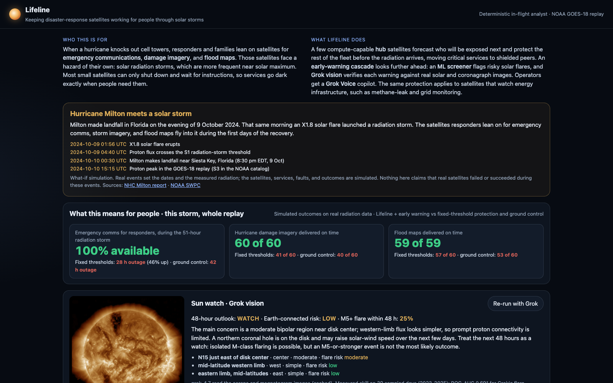
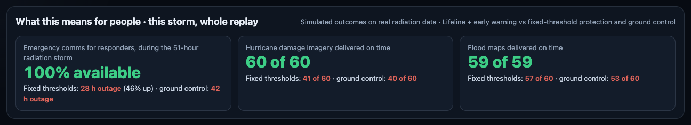
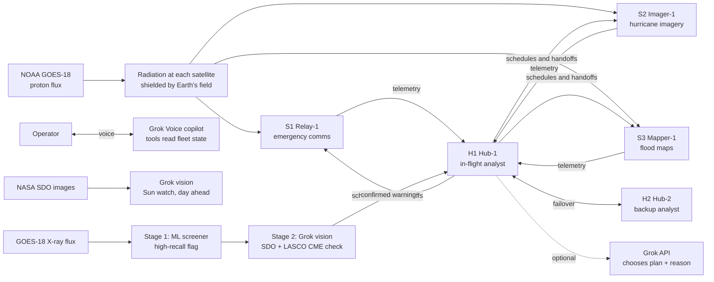
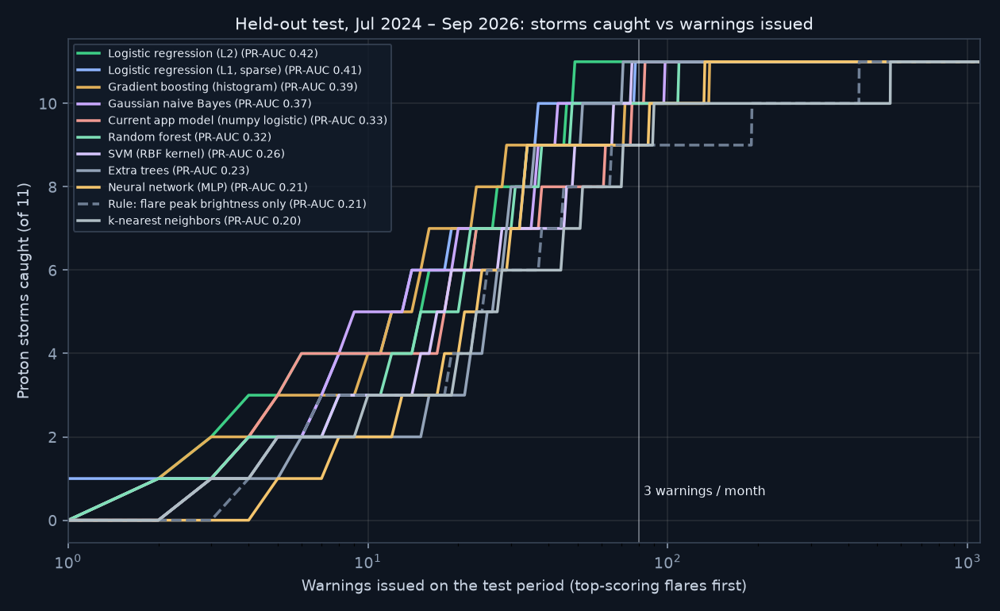
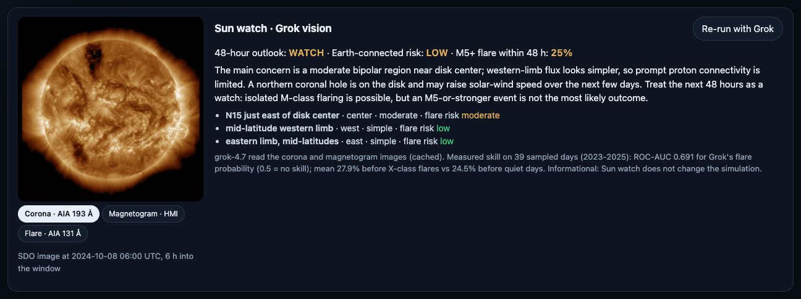
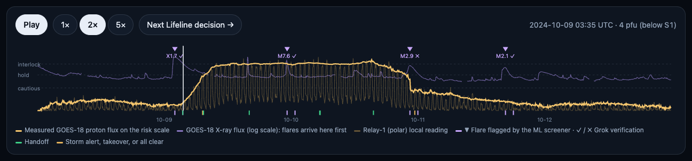
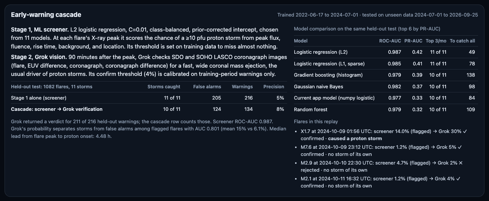
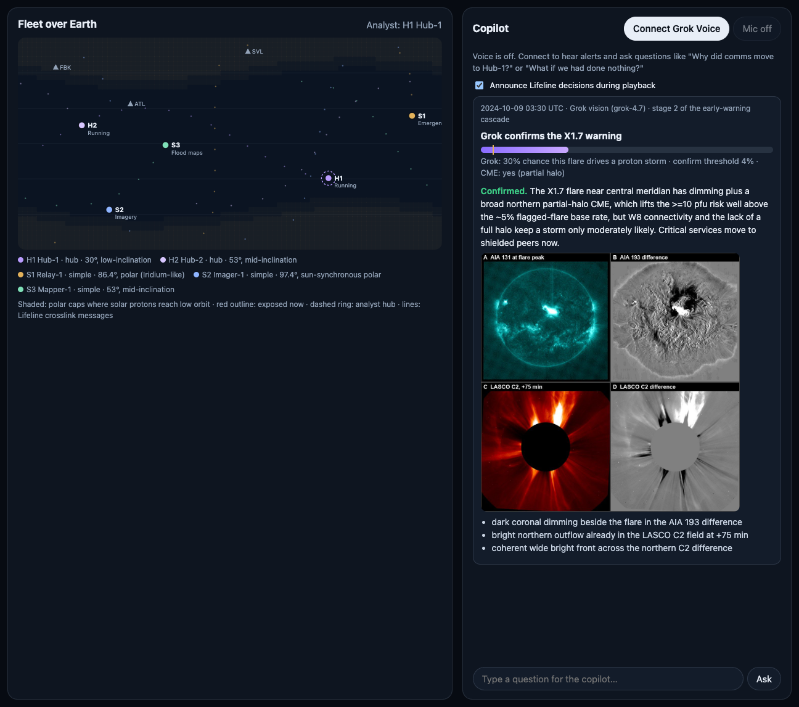
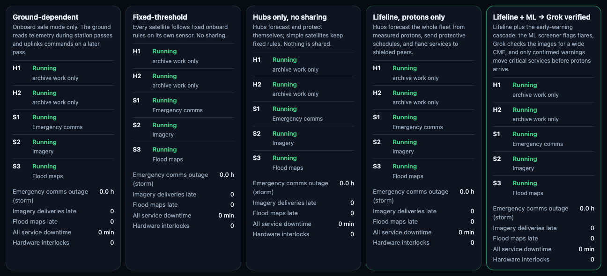
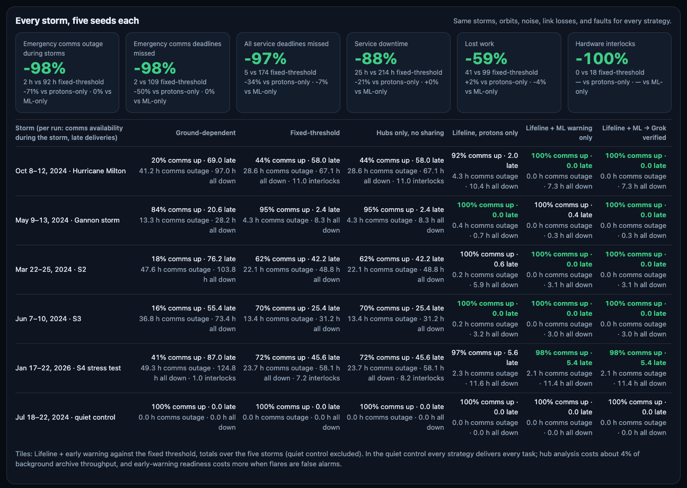

# Lifeline

**Keeping disaster-response satellites working for people through solar storms.**

When a hurricane knocks out cell towers, responders and families lean on satellites for emergency communications, damage imagery, and flood maps. Those satellites face a hazard of their own, solar radiation storms, and most small satellites can only shut down and wait for the ground. Lifeline lets the satellites that can think protect the ones that can't, so the services people depend on stay up.

Built for the **Social Good track (Aramco Americas)**, using the **Grok API** (in-flight analyst, **Grok vision** on real solar and coronagraph images, and the mission debrief), **Grok Voice** (a live operator copilot and the video narration), and **Grok Imagine** (the solar storm visuals in the demo video). An **early-warning cascade** warns of proton storms hours before protons arrive: an ML screener chosen from 11 models flags flares from X-ray data, and **Grok vision verifies each warning** against real solar and coronagraph images.

▶ **Demo video:** [`video/Lifeline_demo.mp4`](video/Lifeline_demo.mp4)



### Impact at a glance
Simulated fleet, real NOAA radiation data from five storms (320 storm hours), five seeds each:

| What people get | Ground-controlled satellites | Fixed-threshold protection | **Lifeline** |
|---|---|---|---|
| Emergency comms outage for responders, all five storms | 188 h | 92 h | **2.1 h** |
| Emergency comms available during Hurricane Milton's radiation storm (51 h) | 20% | 44% | **100%** |
| Hurricane damage imagery on time, Milton week | 39 of 60 | 41 of 60 | **60 of 60** |
| Flood maps on time, Milton week | 53 of 60 | 57 of 60 | **all** |



---

## Contents

1. [The problem](#the-problem)
2. [The solution](#the-solution)
3. [The early-warning chain: ML flare model and Grok Sun watch](#the-early-warning-chain-ml-flare-model-and-grok-sun-watch)
4. [How Grok is used](#how-grok-is-used)
5. [Feature tour](#feature-tour)
6. [Results](#results)
7. [Quick start](#quick-start)
8. [Using the dashboard](#using-the-dashboard)
9. [How the simulation works](#how-the-simulation-works)
10. [Architecture and code map](#architecture-and-code-map)
11. [API reference](#api-reference)
12. [Grok Voice copilot internals](#grok-voice-copilot-internals)
13. [Testing](#testing)
14. [Demo video pipeline](#demo-video-pipeline)
15. [Data provenance](#data-provenance)
16. [What is measured and what is simulated](#what-is-measured-and-what-is-simulated)
17. [Limitations and future work](#limitations-and-future-work)

---

## The problem

Satellites keep critical services running on Earth: communications, disaster imagery, navigation, and weather. They matter most in a crisis.

On **9 October 2024**, Hurricane Milton made landfall in Florida. That same morning an **X1.8 solar flare** launched a radiation storm, and proton flux crossed NOAA's S1 threshold within hours. Responders depend on satellite services at exactly the moment space weather puts them at risk.

Most satellites, especially the small ones launched by companies and universities, are poorly equipped for that moment:

| Limitation | Why it matters in a storm |
|---|---|
| **Small, commercial processors** | Radiation causes bit flips and resets. There is no spare compute to analyze a storm. |
| **Minutes of ground contact per pass** | A low-orbit satellite sees a ground station for about 5–10 minutes, a few times a day. |
| **One built-in defense** | Shut down into safe mode, then wait for the ground. |
| **No foresight** | They can't forecast who will be exposed next or decide which services must keep running. |

Ground-based decisions arrive late or not at all, and isolated fixed-threshold rules react only after the radiation arrives.

## The solution

Lifeline is a cooperative, in-flight protection system:

- **In-flight analysis.** A few compute-capable **hub** satellites collect radiation readings and memory-error telemetry from the fleet over crosslinks. Satellites currently over a polar cap measure the unshielded (ambient) radiation, and the hubs combine that with every satellite's **planned orbit** to forecast exposure for the next orbit.
- **Early warning.** Each satellite receives its own **protective schedule** (when to checkpoint and pause) before the radiation reaches it.
- **Protection.** Simple satellites carry out predefined responses: checkpoint, pause through the forecast exposure, and resume as soon as it passes. **Critical services are handed to shielded peers**, emergency comms first.
- **Coordinated recovery.** After the all-clear, services return to their home satellites.
- **Resilience.** A backup hub takes over if the primary is paused. Simple satellites fall back to fixed rules if they stop hearing from any hub.
- **Seeing it coming.** An early-warning chain looks further ahead than any proton sensor. Grok vision reads real solar images a day ahead. An ML screener flags risky flares at their X-ray peak, and Grok vision verifies each flag against eruption and coronagraph images. Confirmed warnings pre-position critical services hours before protons arrive.



## The early-warning chain: ML flare model and Grok Sun watch

Protons are the damaging part of a solar storm, but they are the **last** thing to arrive. The chain adds earlier looks:

| When | What | Signal | Effect on the fleet |
|---|---|---|---|
| About a day ahead | **Sun watch** (Grok vision) | Real SDO images: AIA 193 Å corona + HMI magnetogram | Briefing and flare-probability estimate for operators (informational) |
| At the flare's X-ray peak | **Stage 1: ML screener** | GOES-18 X-ray flux, which reaches Earth in 8 minutes | High-recall flag → **readiness** (more frequent checkpoints on satellites whose orbits would be exposed) |
| Peak + 90 min | **Stage 2: Grok verification** | SDO EUV difference + SOHO LASCO coronagraph images | Confirm → **pre-position critical services**; reject → **stand down early** |
| Hours later | **Protons** | Polar-cap readings shared over crosslinks | The in-flight analyst's schedules and handoffs, as before |

### Data and features
- **Flares:** every flare of class M1 or stronger in the GOES-18 flare summary (`xrsf-l2-flsum`), June 2022 to September 2026: **1,904 flares**, with locations from `xrsf-l2-flloc`.
- **Labels:** the NOAA solar proton event list. A flare is positive when NOAA names it as the parent of a ≥10 pfu event (within 30 minutes of its peak). There are **24 positives**, so storms are 1.3% of flares.
- **Features, all known at the X-ray peak (no look-ahead):**
  - peak flux
  - fluence from start to peak
  - rise time
  - pre-flare background
  - a magnetic-connectivity term for the source longitude, `exp(-((lon-60)/40)²)`
  - whether a location exists
  - |latitude|
- **Honest protocol:**
  - train on flares before 1 July 2024 (822 flares, 13 storms); test on everything after (1,082 flares, 11 storms)
  - the **Milton week and the January 2026 S4 storm are never trained on**
  - all hyperparameters and thresholds are chosen on training data only
  - replay-window scores are cross-fitted (each window is scored by a model trained without the 60 days around it)

### Stage 1: which model? An 11-way comparison
[`scripts/compare_models.py`](scripts/compare_models.py) tuned every model by grid search on out-of-fold training predictions (half-year blocks), then scored it once on the held-out test ([full table](docs/model_comparison.md)).



| Model | Test ROC-AUC (95% CI) | PR-AUC | Storms caught at 3 warnings/month | Warnings to catch all 11 |
|---|---|---|---|---|
| **Logistic regression, L2, C = 0.01** | **0.987 (0.98–0.99)** | **0.42** | **11 / 11** | **49** |
| Logistic regression, L1 (sparse) | 0.985 | 0.41 | 11 / 11 | 78 |
| Gradient boosting (histogram) | 0.979 | 0.39 | 10 / 11 | 138 |
| Gaussian naive Bayes | 0.982 | 0.37 | 10 / 11 | 98 |
| Logistic regression, lightly regularized (first version) | 0.977 | 0.33 | 10 / 11 | 84 |
| Random forest | 0.979 | 0.32 | 10 / 11 | 109 |
| SVM (RBF kernel) | 0.977 | 0.26 | 11 / 11 | 76 |
| Extra trees | 0.979 | 0.23 | 11 / 11 | 71 |
| Neural network (MLP) | 0.971 | 0.21 | 9 / 11 | 133 |
| Rule: flare peak brightness only | 0.933 | 0.21 | 9 / 11 | 435 |
| k-nearest neighbors | 0.918 | 0.20 | 9 / 11 | 553 |

**Takeaway:** with 24 storms to learn from, a strongly regularized linear model beats trees, boosting, and a neural network, which overfit. Fluence to peak dominates: long-duration flares are the ones that launch coronal mass ejections. With 11 test storms, differences of one or two storms are noise.

**The screener** ([`scripts/train_screener.py`](scripts/train_screener.py) → [`data/models/flare_screen.json`](data/models/flare_screen.json)):
- **Model:** the winning L2 logistic regression, with a prior-corrected intercept so its outputs are calibrated probabilities.
- **Threshold:** set on out-of-fold training predictions to flag ≥90% of training storms (0.87%).
- **Held-out result:** it **catches 11 of 11 storms**, with 216 warnings (about 8 a month, 5% precision). False alarms are expected by design; stage 2 filters them.
- **Runtime:** a 1 KB JSON file evaluated in pure Python, so the app needs no ML libraries.

### Stage 2: Grok verifies each warning
Proton storms are driven by **fast, wide coronal mass ejections (CMEs)**, which X-ray data cannot see but images can. For each flagged flare, [`scripts/verify_warnings.py`](scripts/verify_warnings.py) builds one labeled 2×2 panel of real images from Helioviewer:
- **A:** AIA 131 Å at the peak.
- **B:** an AIA 193 Å difference image (coronal dimming or an EUV wave means an eruption).
- **C:** SOHO LASCO C2 at +75 min.
- **D:** a C2 difference image (a CME front or halo).

Grok (`grok-4.7`, vision) gets the panel plus the triggering numbers and returns a storm probability, whether a CME is visible, its extent, and a reason. No dates are given, and the panels carry no timestamps, so Grok cannot recall famous events.

**Calibration, then test.** The confirm threshold (**4%**) is the highest Grok probability that keeps ≥90% of storms in a calibration set drawn only from training-period warnings (all 12 storms plus 28 random false alarms). It is then applied unchanged to the held-out warnings.

| Held-out test (Jul 2024 – Sep 2026) | Storms caught | False alarms | Warnings | Precision |
|---|---|---|---|---|
| Stage 1 alone (ML screener) | 11 / 11 | 200 | 211 | 5% |
| **Cascade: screener → Grok** | **10 / 11** | **124 (−38%)** | **134** | **8%** |

(Grok returned verdicts for 211 of the 216 held-out warnings; the table counts those.)

- **What Grok gets right.** Its probability separates storms from false alarms among flagged flares with **AUC 0.80** (0.70 on calibration): mean 15% for real storms against 6% for false alarms. It spotted partial-halo CMEs for Milton's X1.7 (30%) and November 2025's X5.1 (30%) and X4.0 (35%).
- **What it costs.** It rejected one real storm: October 2024's X1.8, at 3%.
- **Honest caveat.** The screener's own score separates those same flagged flares even better (AUC 0.93), and combining the two rankings does not beat it (0.93). Much of what Grok sees (big, long flares launch CMEs) overlaps with what the X-ray features already encode. Grok's practical value is that a warning comes with **visual evidence and a reason an operator can check**, and 38% fewer false alarms.
- **An earlier prompt failed, and we changed it.** The first prompt told Grok to "confirm unless there is no eruption". It confirmed 10 of 10 false alarms, because difference images always show some change. The final prompt states the real base rate, explains what streamers and noise look like, and asks for a calibrated probability rather than a verdict.

**In the simulator**, three Lifeline variants face every storm:
- **Protons only.**
- **+ ML warning only:** readiness plus pre-positioning on every screener warning.
- **+ ML → Grok verified** (the primary fleet): readiness on the warning, then pre-positioning only once Grok confirms at peak + 90 min, or an early stand-down if Grok rejects.

A missing verification falls back to the screener. Readiness means checkpoints every 30 min at full speed, and only on satellites whose orbits would be exposed.

### Sun watch (Grok vision)
For every storm, [`scripts/fetch_sun.py`](scripts/fetch_sun.py) pulls real NASA SDO images from Helioviewer at a fixed time, **6 h into the window** (a fixed rule, not a hand-picked moment): the AIA 193 Å corona and the HMI magnetogram. Grok (`grok-4.7`, Responses API with image input) returns:
- notable active regions with position, hemisphere and complexity
- a 48-hour outlook
- Earth-connected risk
- **a numeric probability of an M5-or-stronger flare within 48 h**
- a briefing for operators

The briefings are cached in [`data/sun/assessments.json`](data/sun/assessments.json), and **Re-run with Grok** asks again live.

**Measured skill.** [`scripts/eval_sun_watch.py`](scripts/eval_sun_watch.py) scores Grok on 40 randomly sampled days from 2023–2025: 20 followed by an X-class flare within 48 h, and 20 with no flare of M5 or stronger. Results ([`data/sun/eval.json`](data/sun/eval.json), 39 of 40 days completed):
- **Numeric flare probability: ROC-AUC 0.69.** Grok gives a slightly higher probability before X-class flares (mean 27.9%) than before quiet days (24.5%). That is some skill, but modest and uncertain with 39 days (roughly ±0.17), and the probabilities are compressed into 15–40%.
- **3-level outlook: no skill** (AUC 0.50). Grok answered "watch" on every one of the 39 days.
- **Takeaway.** Reading two full-disk images is not enough for a confident flare forecast. That is why the Sun watch stays a briefing and the proton-storm decision uses the X-ray model.

The Sun watch is **informational**: it does not change the simulation's scores.

## How Grok is used

| Grok product | Role in Lifeline | Where |
|---|---|---|
| **Grok API** (chat) | **In-flight analyst.** When a service is at risk, Grok receives the candidate plans with forecast outcomes (downtime in minutes, lost-work risk, interlock risk) and picks one with a plain-language reason. A choice runs only if it matches a validated candidate; otherwise the deterministic analyst decides. | [`backend/grok.py`](backend/grok.py) `analyst_choice`, [`backend/sim.py`](backend/sim.py) `_analyze` |
| **Grok API** (vision) | **Sun watch.** Grok reads real SDO corona and magnetogram images and returns active regions, a 48-hour outlook, and a flare probability. Its skill is measured on 40 sampled days. | `sun_watch`, `POST /api/sun` |
| **Grok API** (chat) | **Morning-after debrief** for operators and emergency coordinators, written only from the simulator's numbers. | `debrief`, `POST /api/debrief` |
| **Grok Voice** (realtime) | **Operator copilot.** It announces fleet events, including flare warnings, during playback and answers questions using seven client-side tools that read the replay state, among them the space-weather outlook. It can also play, pause, and jump to decisions. | [`web/voice.js`](web/voice.js), `voiceTools()` in [`web/app.js`](web/app.js) |
| **Grok Voice** (force message) | **Narration** of the demo video, in the "Rex" voice; the copilot speaks as "Eve". | [`video/tts.py`](video/tts.py) |
| **Grok Imagine** (video) | Solar flare, magnetosphere impact, and constellation-over-hurricane clips in the demo video. | `video/imagine_*.mp4` |

The Grok analyst and copilot are **remote API calls standing in for onboard reasoning**, and the UI labels them that way. Scores always come from the simulator, never from a model.

## Feature tour

### What this means for people
The panel under the mission banner restates the replay's outcome in human terms: emergency-comms availability for responders during the storm, and damage imagery and flood maps delivered on time. It compares Lifeline with fixed-threshold protection and ground control. Fleet scoreboards, the evaluation table, the voice copilot, and the Grok debrief use the same terms.

### Mission context, Sun watch, and replay timeline




- **Mission banner.** Every storm opens with a dated, sourced banner and a what-if disclaimer.
- **Sun watch card.** Below the banner, it shows the real SDO images (corona, magnetogram, and the flare itself) with Grok's briefing, 48-hour outlook, flare probability, and measured skill.
- **Timeline.** It plots:
  - the measured GOES-18 proton flux on the simulator's risk scale, with the cautious, hold, and interlock levels marked
  - the **GOES-18 X-ray flux** in violet, where flares appear first
  - **▼ flare markers** labeled with the model's proton-storm probability
  - the polar relay satellite's own reading, which spikes on every polar-cap pass

  Tick marks: green for handoffs, violet for flare warnings and stand-downs, amber for storm alerts, takeovers, and all-clears. Click the chart or use the arrow keys (Shift for 12 steps) to seek.

### Flare warning, Grok verification, and the cascade card
- **Flare-warning decision card (stage 1).** The screener's probability against its high-recall threshold, the flare's class and location, and the expected proton-onset window.
- **Grok-verification card (stage 2).** Shown at peak + 90 min: Grok's storm probability against the confirm threshold, whether it saw a CME and how wide, its reasoning, the eruption signs it found, and **the exact 4-panel image it looked at**.
- **Milton's week:**
  1. X1.7 flagged at 02:00 UTC on 9 October
  2. Grok confirmed at 03:30 (30%, partial-halo CME)
  3. emergency comms moved to Hub-1
  4. protons detected about 4 hours later
- **Cascade card.** Stage 1 alone against the full cascade on held-out data, the 11-model comparison, and every flagged flare in the current replay with its screener score, Grok verdict, and outcome.



### Fleet map and decision card


- **Map.** The ground track shades the polar caps where solar protons reach low orbit, brighter as the storm grows. Each satellite shows its trail, its current services, and a red outline when exposed. A dashed ring marks the hub currently acting as analyst. Lines are Lifeline crosslink messages delivered on this step: dashed for schedules, solid green for handoffs. Ground stations (Svalbard, Fairbanks, Atlanta) are marked.
- **Decision card.** It shows the latest Lifeline decision, most critical service first: who decided (analyst hub or Grok), the reason, and every option compared, with forecast downtime and lost-work risk.

### Five fleets, one storm


The same storm hits five fleets side by side: ground-dependent, fixed-threshold, hubs only, **Lifeline (protons only)**, and **Lifeline + early warning**. Each card shows every satellite's live mode and services. The scoreboard (emergency-comms deadlines missed, all deadlines missed, downtime, lost work, interlocks) highlights the best value in green.

### Copilot (Grok Voice)
- **Connect Grok Voice** opens a realtime session. Turn the mic on to talk, or type in the box; typed questions go through the same voice session.
- With *Announce Lifeline decisions* on, each storm alert, handoff, takeover, and all-clear is spoken as playback reaches it.
- Tool calls appear in the transcript ("Grok checked get latest decision"), so you can see what Grok looked at.

### Grok as in-flight analyst
Tick **Grok as in-flight analyst** to re-run the replay with Grok choosing among the validated plans. The status bar shows how many decisions Grok made and the latency, and the decision card labels them "Grok in-flight analyst".

### Stress controls
- **Crosslink delay:** 5–30 minutes.
- **Link loss:** 0–50%, where every message has an independent chance of being dropped.
- **Seed:** noise, telemetry, link, and fault draws.

With 100% loss, Lifeline degrades to fixed rules; that case is covered by a test.

### Evaluation across storms


Every storm runs with five seeds for all five strategies under identical conditions. Headline tiles compare Lifeline + early warning with fixed-threshold protection and with protons-only Lifeline, and the table gives per-storm results.

### Morning-after debrief
**Write with Grok** produces a four-paragraph report: the situation, what Lifeline did and when, how it compared, and one limitation. It is written only from the simulator's facts.

## Results

Five seeds per storm, default settings (5-minute crosslink delay, no link loss), all strategies under identical conditions. Reproduce with `POST /api/evaluate` or the "Every storm" panel.

**In terms of people served.** Emergency comms availability during each radiation storm (from the first to the last ≥10 pfu sample), per run:

| Storm | Ground-dependent | Fixed-threshold | Lifeline, protons only | **Lifeline + early warning** |
|---|---|---|---|---|
| Oct 2024 · Hurricane Milton (51 h) | 20% (41 h out) | 44% (29 h out) | 92% (4.3 h out) | **100% (0 h out)** |
| May 2024 · Gannon storm | 84% (13 h out) | 95% (4.3 h out) | 100% (0.4 h out) | **100% (0 h out)** |
| Mar 2024 | 18% (48 h out) | 62% (22 h out) | 100% (0.2 h out) | **100% (0 h out)** |
| Jun 2024 | 16% (37 h out) | 70% (13 h out) | 100% (0.2 h out) | **100% (0 h out)** |
| Jan 2026 · S4 stress test | 41% (49 h out) | 72% (24 h out) | 97% (2.3 h out) | **98% (2.1 h out)** |
| **All five storms (320 h)** | **188 h out** | **92 h out** | **7.3 h out** | **2.1 h out** |

Hurricane imagery on time, Milton week: 39 / 41 / 60 / 60 of 60. Flood maps on time: 53 / 57 / 60 / 59 of 60 (the last early-warning task was still in progress when the replay ended).

**In engineering terms:**

**Totals over the five storm windows** (quiet control excluded):

| | Ground-dependent | Fixed-threshold | Hubs only | Lifeline, protons only | + ML warning only | **+ ML → Grok verified** |
|---|---|---|---|---|---|---|
| Emergency comms deadlines missed | 187.8 | 109.0 | 109.0 | 4.4 | 2.2 | **2.2** |
| All service deadlines missed | 308.2 | 173.6 | 173.6 | 8.2 | 5.8 | **5.4** |
| Service downtime | 427 h | 214 h | 214 h | 32 h | 25 h | **25 h** |
| Lost work (units) | 56.3 | 99.2 | 106.7 | 40.4 | 42.8 | **41.1** |
| Hardware interlocks | 1.0 | 18.2 | 19.2 | 0 | 0 | **0** |

**Lifeline with the Grok-verified cascade, compared with:**
- **Fixed-threshold protection:** 98% fewer missed emergency-comms deadlines, 97% fewer missed deadlines overall, 88% less downtime, and no hardware interlocks.
- **Protons-only Lifeline:** early warning halves the missed emergency-comms deadlines and cuts missed deadlines by 34% and downtime by 21%.
- **ML-only warnings:** Grok's verification cuts missed deadlines by 7% and lost work by 4% with the same protection, because rejected warnings end readiness early and skip needless handoffs. In the replay windows, **every flare that actually caused a storm was confirmed.**

**Per storm** (per run: emergency-comms / all deadlines missed · downtime):

| Storm | Fixed-threshold | Lifeline, protons only | + ML only | **+ ML → Grok** |
|---|---|---|---|---|
| Oct 8–12, 2024 · Hurricane Milton (S3) | 36.0 / 58.0 · 67.1 h | 2.0 / 2.0 · 10.4 h | 0.0 / 0.0 · 7.3 h | **0.0 / 0.0 · 7.3 h** |
| May 9–13, 2024 · Gannon storm (S2) | 2.2 / 2.4 · 8.3 h | 0.0 / 0.0 · 0.7 h | 0.0 / 0.4 · 0.3 h | **0.0 / 0.0 · 0.3 h** |
| Mar 22–25, 2024 (S2) | 27.4 / 42.2 · 48.8 h | 0.2 / 0.6 · 5.9 h | 0.0 / 0.0 · 3.1 h | **0.0 / 0.0 · 3.1 h** |
| Jun 7–10, 2024 (S3) | 16.0 / 25.4 · 31.2 h | 0.0 / 0.0 · 3.2 h | 0.0 / 0.0 · 3.0 h | **0.0 / 0.0 · 3.0 h** |
| Jan 17–22, 2026 · S4 stress test | 27.4 / 45.6 · 58.1 h | 2.2 / 5.6 · 11.6 h | 2.2 / 5.4 · 11.4 h | **2.2 / 5.4 · 11.4 h** |
| Jul 18–22, 2024 · quiet control | 0 / 0 · 0 h | 0 / 0 · 0 h | 0 / 0 · 0 h | 0 / 0 · 0 h |

Ground-dependent and hubs-only per-storm numbers are in the dashboard's evaluation table.

**Reading these honestly.**
- **The gain comes from sharing.** "Hubs only" gives hubs the same forecasting but shares nothing, and it scores the same as the fixed threshold.
- **Early warning helps at storm onset,** before any satellite has measured protons. That is where protons-only Lifeline's remaining misses were.
- **Grok's fleet-level gain over ML-only is small.** Readiness is cheap once it is scoped to exposed satellites, so false alarms were already inexpensive.
- **There is a steady cost.** In the quiet control every strategy delivers every task, and hub analysis costs about 4% of background archive throughput.
- **The S4 storm is the hardest case.** Even shielded orbits are exposed.
- **The model helps forecasting.** Exposure is a deterministic function of orbit in this simulator; real radiation has more spatial and temporal structure. See [limitations](#limitations-and-future-work).

## Quick start

Requirements: Python 3.11+ (developed on 3.14) and an xAI API key for the Grok features. Everything else works without a key.

```bash
git clone <this repo> && cd GT_hack
python3 -m venv .venv
.venv/bin/pip install -r requirements.txt
cp .env.example .env          # then set XAI_API_KEY=...
.venv/bin/uvicorn backend.app:app --host 127.0.0.1 --port 8010
```

Open **http://127.0.0.1:8010**. The Milton week loads by default. The first load precomputes the replay and the five-seed evaluation in the background (about 10 seconds); after that, results are cached in memory.

`.env` settings:

| Variable | Required | Purpose |
|---|---|---|
| `XAI_API_KEY` | For Grok features | Grok analyst, Grok Voice sessions, debrief. The server keeps it; browsers only get short-lived voice tokens. |
| `XAI_MODEL` | No (default `grok-4`) | Chat model for the analyst and the debrief. |

Without a key, the Grok controls are disabled and the deterministic analyst runs everything.

## Using the dashboard

A good demo path:

1. Open `http://127.0.0.1:8010/#t=300`. The `#t=` fragment jumps to a replay step; there are 12 steps per hour. Read the **Sun watch** card: Grok's day-ahead briefing from real SDO images.
2. Press **Next Lifeline decision →**. You'll see:
   - the **flare warning** for the X1.7 flare (proton-storm probability against the threshold, expected onset)
   - **Hand Emergency comms from S1 to H1**, before any protons have arrived
   - the storm alert, about 5 hours later
3. Press **Play** at 5×, and watch the crosslink lines and the five fleets diverge.
4. Click **Connect Grok Voice**, allow the microphone, turn **Mic** on, and ask:
   - "What's happening right now?"
   - "Why did emergency comms move to Hub-1?"
   - "What if we had done nothing?"
   - "What's the space-weather outlook?"
   - "Compare the strategies."
   - "Jump to the next decision."
5. Tick **Grok as in-flight analyst** and step through the decisions again.
6. Scroll to **Every storm** for the evaluation, then **Write with Grok** for the debrief.

Controls:

| Control | Effect |
|---|---|
| Storm | One of five NOAA storm windows or the quiet control |
| Crosslink delay | Message delivery delay, 1–6 steps (5–30 min) |
| Link loss | Independent drop probability per message, 0–50% |
| Seed | Sensor noise, telemetry, link-loss, and fault draws |
| Grok as in-flight analyst | Re-runs the replay with Grok choosing handoff plans (up to 3 calls) |
| Play / 1× 2× 5× | Playback at 6, 12, or 30 steps per second |
| Next Lifeline decision | Jumps to the next flare warning, stand-down, storm alert, handoff, takeover, return, or all-clear |
| Sun watch · Re-run with Grok | Asks Grok vision again, live, about the window's solar images |

## How the simulation works

### Fleet

| Satellite | Role | Orbit | Service (priority) |
|---|---|---|---|
| **H1 Hub-1** | Hub, primary analyst | 30°, shielded by Earth's field | Safe harbor for handed-off services |
| **H2 Hub-2** | Hub, backup analyst | 53° | Takes over when H1 is paused or silent |
| **S1 Relay-1** | Simple | 86.4° polar (Iridium-like) | Emergency comms relay (**critical**) |
| **S2 Imager-1** | Simple | 97.4° sun-synchronous | Hurricane imagery processing (essential) |
| **S3 Mapper-1** | Simple | 53° | Flood-mapping inference (essential) |

Every satellite also runs best-effort **archive** work that soaks up spare capacity.

### Radiation exposure
GOES-18 sits outside the magnetosphere, so its flux stands for the unshielded level. Orbits are circular (inclination, period, ascending node, phase). A **tilted geomagnetic dipole** gives each position a magnetic latitude, and exposure ramps from 0.4% below 55° to 100% above 63°, averaged over each 5-minute step. The polar satellites cross a cap for 15–20 minutes twice per orbit, and H1 is effectively always shielded.

Flux maps to a 0–1 **risk scale**: 10 pfu (S1) stays below *cautious* (0.35), 100 pfu (S2) meets *hold* (0.55), and 1,000 pfu (S3) meets the *hardware interlock* (0.72).

### Local readings
Each satellite combines two sources:
- a particle sensor with noise σ = 0.04, whose confidence comes from the archive's quality flags (0 during data gaps)
- a Poisson memory-error count with rate 12 × risk², smoothed into a hardware estimate

The two are blended by confidence, so a sensor gap doesn't blind the satellite.

### Workload
- **Emergency comms** releases a 25-minute task every hour, due within the hour.
- **Imagery** and **flood maps** release 50-minute tasks every 2 hours.
- Scheduling is critical first, then earliest deadline first, then archive work.
- A completed task commits its result. Otherwise, progress survives only past a checkpoint.

### Faults
- While a payload is active (computing or checkpointing), each step has hit probability **risk² × 0.03**. A hit loses unsaved work.
- Safe mode powers the payload down, so unsaved work is lost unless it was checkpointed first.
- A **hardware interlock** forces safe mode at true risk ≥ 0.72; no controller can override it.

### The strategies
All fleets share one storm, one set of orbits, and the same noise, telemetry, link-loss, and fault draws. Only the strategy differs. The dashboard shows five fleet cards; "+ ML warning only" appears in the evaluation table as the ablation for Grok's verification.

| Strategy | Behavior |
|---|---|
| **Ground-dependent** | Onboard safe mode only. Ground stations (Svalbard, Fairbanks, Atlanta; contact within 18° of arc) read telemetry during passes. After 30 minutes of analysis, they uplink commands (hold, cautious, resume) on a later pass. Interlocked satellites wait for a ground resume. |
| **Fixed-threshold** | Each satellite reacts to its own sensor: cautious at 0.35, checkpoint-then-hold at 0.55, resume after 3 quiet steps below 0.28. |
| **Hubs only, no sharing** | Hubs forecast and protect themselves; simple satellites keep fixed rules. Nothing is shared. |
| **Lifeline, protons only** | Hubs analyze the whole fleet from measured protons, send schedules and handoffs, fail over, and support fallback, as described below. |
| **+ ML warning only** | Protons-only Lifeline plus the stage-1 screener: readiness and pre-positioning of critical services on every flagged flare. |
| **+ ML → Grok verified** | The full early-warning cascade: readiness on the flag, then pre-positioning only after Grok confirms, and an early stand-down if it rejects. |

### Lifeline's in-flight analyst
Each step, the active hub:
1. **Updates the ambient estimate** from any report whose satellite is at least 60% exposed: `ambient = risk(flux_reading / exposure)`. The estimate is kept for up to 2 hours.
2. **Forecasts exposure windows** for every satellite over the next orbit (19 steps): the contiguous steps where `risk(ambient_flux × planned_exposure) ≥ 0.55`.
3. **Sends schedules** to each simple satellite when its windows change, and every 15 minutes regardless, for robustness to loss.
4. **Plans services.** During a storm (ambient ≥ 0.45), for each service whose host has a forecast window, it builds candidates:
   - *stay*: checkpoint and pause through each window
   - *no-action*: rely on built-in rules; shown for comparison, never executed
   - *move:X*: hand off to any peer with capacity whose forecast peak stays below 0.35

   Candidates are scored as `tier_weight × downtime + lost_risk + 10 × interlock_risk`, with critical weighted 3 and essential 1. A move must beat staying by a margin. Grok can make this choice when enabled.
5. **Returns services home** once ambient is back below 0.28 and the home satellite is running, has capacity, and is forecast clear.
6. **Announces** storm detection, analyst takeovers, and all-clears.

Simple satellites follow their schedule: they checkpoint and pause the step before a forecast window and resume as soon as it passes. They carry out handoffs (checkpoint, then transfer), always pause locally if their own reading reaches the hold level, and fall back to fixed rules after 60 minutes without a hub message.

### Messaging
Crosslink messages are `report` (every satellite to each hub, every step), `schedule`, `handoff`, and `return`. Each is delivered after the configured delay, and each can be dropped by an independent, seeded draw. The analyst uses **only delivered messages plus planned orbits**; it never sees true risk or future samples.

### Metrics

| Metric | Definition |
|---|---|
| Emergency comms deadlines missed | Critical relay tasks not finished by their deadline |
| All service deadlines missed | Tasks missed across all three services |
| Service downtime | Steps an essential service spent not running on an active payload (×5 min) |
| Mean time to restore | Average length of those interruptions |
| Lost work | Unsaved progress destroyed by faults or power-downs |
| Hardware interlocks | Forced safe-mode trips at risk ≥ 0.72 |
| Handoffs | Service transfers started |
| Archive | Best-effort work completed |

### Key parameters ([`backend/fleet.py`](backend/fleet.py), [`backend/analyst.py`](backend/analyst.py))

| Parameter | Value | Meaning |
|---|---|---|
| `CAUTIOUS` / `HOLD` / `CLEAR` / `SAFETY_LIMIT` | 0.35 / 0.55 / 0.28 / 0.72 | Risk thresholds |
| `HORIZON` | 19 steps | Forecast horizon (about one orbit) |
| `CHECKPOINT_STEPS`, `TRANSFER_STEPS` | 1, 1 | Five minutes each |
| `RECOVER_STEPS` / `RECOVER_PLANNED` | 2 / 1 | Health check after an unplanned or planned pause |
| `RESUME_STREAK` | 3 | Quiet steps before fixed rules resume |
| `NORMAL_` / `CAUTIOUS_CHECKPOINT_EVERY` | 12 / 4 | Periodic checkpoint interval |
| `GROUND_ANALYSIS_STEPS` | 6 | Ground turnaround (30 min) |
| `FALLBACK_AFTER` | 12 | Silence before a simple satellite uses fixed rules |
| `ANALYST_LOAD` | 0.15 | Compute the active hub spends on analysis |
| `SERVICE_CAPACITY` | 0.95 | Maximum service load per satellite |
| `HIT_SCALE` | 0.03 | Fault probability scale |
| `STORM_LEVEL` / `AMBIENT_MEMORY` / `MOVE_MARGIN` | 0.45 / 24 / 2.0 | Analyst settings |

## Architecture and code map

```
GT_hack/
├── backend/
│   ├── app.py        FastAPI app: endpoints, caching, gzip, startup warm-up, debrief facts
│   ├── space.py      NOAA replay loading, missions, orbits, dipole exposure, ground contact, risk scale
│   ├── fleet.py      Satellites, roles, services, thresholds, durations
│   ├── analyst.py    Ambient estimate, exposure windows, candidate plans, scoring, explanations
│   ├── sim.py        Environment draws, fleet state, five controllers, crosslinks, execution, scores, evaluation
│   ├── earlywarning.py  Flare model inference (pure Python from JSON), replay-window warnings
│   └── grok.py       Grok API: analyst choice, Sun watch (vision), debrief, realtime client secrets
├── web/
│   ├── index.html    Dashboard layout
│   ├── styles.css    Dark theme, responsive grid
│   ├── app.js        Replay, chart, map, fleets, evaluation, copilot tools, debrief
│   └── voice.js      Grok Voice realtime client (24 kHz PCM in and out, tools, barge-in)
├── data/noaa/        GOES-18 proton fixtures (JSON) + manifest; xray/ has the X-ray curve per window
├── data/flares/      training.csv (1,904 flares), window_screen.json (cross-fitted), train/test_warnings.json, verifications.json
├── data/models/      flare_screen.json (stage 1), cascade_eval.json (stage 2), comparison.json (11 models)
├── data/verify/      Grok verification panels for flares flagged in the replay windows
├── data/sun/         SDO images per window, Grok briefings (assessments.json), skill check (eval.json)
├── scripts/
│   ├── extract_noaa.py        Rebuilds proton fixtures from NCEI NetCDF files
│   ├── build_flares.py        Flare dataset + labels + X-ray curves from NCEI and the NOAA SEP list
│   ├── train_flare_model.py   Trains and evaluates the early-warning model
│   ├── compare_models.py      11-model comparison for the flare screener (needs requirements-ml.txt)
│   ├── train_screener.py      Stage-1 screener: tuned logistic regression, high-recall threshold
│   ├── verify_warnings.py     Stage-2 Grok verification: SDO + LASCO panels, calibration, held-out evaluation
│   ├── fetch_sun.py           Downloads SDO images from Helioviewer
│   ├── precompute_sun.py      Caches Grok's Sun-watch briefings
│   └── eval_sun_watch.py      Measures Grok's Sun-watch skill on 40 sampled days
├── tests/test_lifeline.py    18 tests
├── video/            Demo video, narration script, recording and assembly scripts, Imagine clips
├── docs/             README screenshots
└── archive/          Previous version (lifeline-v1.tar.gz)
```

Each run is request-local and deterministic for a given (storm, seed, delay, loss). The server caches recent runs and evaluations with `functools.lru_cache`, and responses are gzip-compressed (a full Milton replay is about 5 MB raw, about 200 KB compressed).

## API reference

All `POST` bodies share one schema. Every field is optional:

```json
{ "window": "oct2024", "seed": 7, "latency": 1, "loss": 0.0, "grok": false }
```

`window` is one of `oct2024`, `may2024`, `mar2024`, `jun2024`, `jan2026`, or `quiet2024`. `seed` is 1–99; `latency` is 1–6 steps; `loss` is 0–0.6.

| Endpoint | Returns |
|---|---|
| `GET /` | The dashboard |
| `GET /api/events` | Storm windows (label, dates, peak, catalog check, mission story) and `grok` (whether a key is set) |
| `POST /api/run` | One replay: `frames` (one per 5-minute step), `decisions` (from Lifeline + early warning; `decisionsProtonsOnly` for the ablation), `summary` for all five strategies, `xray`, `flares` (with model probabilities), `earlyWarning` (model card), `mission`, `satellites`, `services`, `logs`, `messages`, `advisorCalls`. With `grok: true` and a key, Grok acts as analyst. |
| `POST /api/sun` | `{window, refresh}` → `{images, assessment, evaluation}`: SDO image paths (served under `/sun/`), Grok's cached briefing (or a live one with `refresh: true` and a key), and the measured skill. |
| `POST /api/evaluate` | Five seeds × every storm for the given `latency` and `loss`: `rows[].scores[strategy]` and `headline` (totals and % change vs each baseline). Cached. |
| `POST /api/voice/session` | `{token, expiresAt, url, model}`, a 10-minute Grok Voice client secret. Returns 503 without a key. |
| `POST /api/debrief` | `{text, latencyMs, model, facts}`. The Grok-written report and the exact facts it was given. |

Each frame contains:
- `sats[id]`: fused risk, true risk, exposure, latitude and longitude, error count, and ground contact
- `fleets[strategy]`: each satellite's mode label, tone, and services; the running scores; and the active analyst
- `links`: Lifeline crosslink messages delivered on that step

## Grok Voice copilot internals

1. The browser calls `POST /api/voice/session`. The server mints a short-lived client secret with `POST https://api.x.ai/v1/realtime/client_secrets`, so the API key never reaches the browser.
2. The browser opens `wss://api.x.ai/v1/realtime?model=grok-voice-latest` with the subprotocol `xai-client-secret.<token>`, then sends `session.update` with the copilot instructions, voice `eve`, server voice-activity detection, 24 kHz PCM in and out, and the tools.
3. Microphone audio is captured by an AudioWorklet, converted to 16-bit PCM, and streamed as `input_audio_buffer.append` in 100 ms chunks. Reply audio (`response.output_audio.delta`) is scheduled gaplessly and stops immediately when you start talking.
4. Tool calls (`response.function_call_arguments.done`) run **in the browser** against the loaded replay. Results go back as `function_call_output`, then `response.create`.

| Tool | Purpose |
|---|---|
| `get_situation` | Replay time, measured flux and NOAA S-level, active analyst, satellites exposed now |
| `get_fleet_status(strategy?)` | Every satellite's role, orbit, mode, services, reading, exposure, and errors |
| `get_latest_decision(service?)` | The latest decision (optionally for one service) with its reason and every option compared |
| `get_space_weather_outlook` | Grok's Sun-watch briefing, the latest ML flare warning (probability, class, expected onset), and the model's held-out skill |
| `compare_strategies` | Scores so far and for the whole replay, for all five strategies |
| `get_recent_events(count?)` | Recent flare warnings, storm alerts, handoffs, takeovers, and returns |
| `control_playback(action)` | `play`, `pause`, or `next_decision` |

Fleet events are pushed to the session as `[Fleet event …]` messages with a per-response instruction to announce them briefly without calling tools.

## Testing

```bash
.venv/bin/python -m pytest tests
```

[`tests/test_lifeline.py`](tests/test_lifeline.py) covers:
- **Physics:** the risk scale round-trips; polar orbits cross the caps 20–45% of the time; H1 stays shielded.
- **No look-ahead:** multiplying the flux after step 600 leaves every earlier frame identical.
- **Messaging:** the analyst decides under delay; with 100% loss every message drops and no handoff happens.
- **Protection:** planned pauses lose no unsaved work.
- **Outcomes:** in Milton week, Lifeline beats all three baselines on critical deadlines and downtime, with no interlocks; the quiet control needs no handoffs and misses nothing.
- **Grok safety:** an invalid Grok choice falls back to the analyst, and the payload uses minutes and plain field names.
- **API:** Milton is the default, frames have the expected shape, voice sessions require a key, and the debrief facts match the run.
- **Early warning:**
  - the screener's runtime inference matches the training export, and it caught every held-out storm
  - a flare warning never precedes the flare's X-ray peak
  - the quiet control has no warnings
  - an unverified false alarm pre-positions emergency comms, stands down, and returns it home
  - a Grok rejection at peak + 90 min prevents pre-positioning, while ML-only still hands off
  - the Sun watch is served from cache without a key

The tests make no network calls; Grok is mocked where needed.

## Demo video pipeline

[`video/Lifeline_demo.mp4`](video/Lifeline_demo.mp4) is produced by scripts in `video/`:

| Step | Script / asset |
|---|---|
| Solar storm clips | Grok Imagine video (`grok-imagine-video-1.5`, 10 s, 720p): `imagine_flare.mp4`, `imagine_impact.mp4`, `imagine_fleet.mp4` |
| Narration | [`tts.py`](video/tts.py): Grok Voice `force_message` speaks the exact [`script.json`](video/script.json) lines in the "Rex" voice |
| Slides and overlays | [`slides.html`](video/slides.html) rendered to PNG with Playwright |
| App walkthrough | [`record.py`](video/record.py): Playwright drives the running app in Chrome at 1080p, with a visible cursor, subtitles, and live Grok calls, and logs segment times and waits to cut |
| Edit | [`assemble.py`](video/assemble.py): ffmpeg composites the clips, slides, and walkthrough, places narration at the logged times, speaks Grok's live copilot answer in "Eve", and cuts waiting time |

The video tools need `playwright`, `imageio-ffmpeg`, `websockets`, `certifi`, and `numpy`. They are kept out of `requirements.txt` because the app doesn't need them. Start the app on port 8010, then run `record.py` and `assemble.py`.

## Data provenance

The fixtures in `data/noaa/` come from NOAA NCEI GOES-18 `sgps-l2-avg5m` files; rebuild them with [`scripts/extract_noaa.py`](scripts/extract_noaa.py). `AvgIntProtonFlux` in those files is the >500 MeV channel, not the ≥10 MeV integral behind the NOAA S scale, so it is not used. Each sample is the westward `AvgDiffProtonFlux` summed over channel widths at and above 10 MeV, in protons/(cm² sr s). Timestamps are at a 5-minute cadence. Quality flags are kept, and gaps stay missing (sensor confidence 0).

| Window | NOAA catalog peak | Extracted channel sum |
|---|---|---|
| 2024-10-10 15:15 UTC (Milton week) | 1,810 pfu, S3 | 2,932 pfu |
| 2024-05-10 17:45 UTC (Gannon storm) | 208 pfu, S2 | 404 pfu |
| 2024-03-23 18:20 UTC | 956 pfu, S2 | 1,006 pfu |
| 2024-06-08 08:00 UTC | 1,030 pfu, S3 | 996 pfu |
| 2026-01-19 19:15 UTC | 37,000 pfu, S4 | 42,201 pfu |

The quiet control (18–22 July 2024) peaks at 0.54 pfu. Peak times match the catalog; magnitudes differ because this is a channel sum, not the SWPC integral product.

**Early-warning data** ([`scripts/build_flares.py`](scripts/build_flares.py)):
- **Flare summary:** GOES-18 XRS flare summary `sci_xrsf-l2-flsum_g18_s20220617_e20260925_v2-2-1.nc`. It has start, peak, and end records per flare; at the peak record, `integrated_flux` is the running integral from the start.
- **Flare locations:** `sci_xrsf-l2-flloc_g18_…nc`, with Stonyhurst longitude and latitude by `flare_id`. The file stores longitude as 0–360°, and it is wrapped to ±180° (east negative).
- **X-ray curves:** daily `xrsf-l2-avg1m_science` files, reduced to 5-minute XRS-B maxima.
- **Labels:** the NOAA [Solar Proton Events Affecting the Earth Environment](https://www.ngdc.noaa.gov/stp/space-weather/interplanetary-data/solar-proton-events/SEP%20page%20code.html) list. 40 events since 2022; 25 match a GOES-18 flare peak within 30 minutes, and 24 of those parents are M1 or stronger. The rest predate GOES-18, came from the far side, or have no flare listed.

**Solar images:** NASA SDO AIA 193 Å, AIA 131 Å, and HMI magnetogram full-disk images, and SOHO LASCO C2 coronagraph images, through the [Helioviewer API](https://api.helioviewer.org/docs/v2/). Sun-watch images are stored in `data/sun/`, and verification panels for replay-window flares in `data/verify/`. The verifier's LASCO images are skipped if no frame exists within 40 minutes of the requested time.

Event sources:
- [NHC Hurricane Milton report](https://www.nhc.noaa.gov/data/tcr/AL142024_Milton.pdf)
- [NOAA SWPC G4 watch, Oct 2024](https://www.swpc.noaa.gov/news/g4-severe-storm-watch-10-11-october)
- [NOAA SWPC S4 notice, Jan 2026](https://www.spaceweather.gov/news/s4-severe-solar-radiation-storm-progress-january-19th-2026)
- [GOES-R space environment in-situ data](https://www.ncei.noaa.gov/products/goes-r-space-environment-in-situ)

## What is measured and what is simulated

**Measured:** the GOES-18 proton series, its timestamps, and its quality flags; the GOES-18 X-ray flux, flare records, and flare locations; the NOAA proton-event list; and the SDO solar images.

**Simulated, and labeled as such:** the satellites and orbits, the shielding model, sensor noise, error telemetry, faults, services, crosslinks, ground passes, and the flux-to-risk scale.

It is a **what-if**: real events set the dates and the radiation, not the outcomes. Nothing here claims that real satellites failed or succeeded during these events.

## Limitations and future work

- **Shielding model.** A tilted dipole with a fixed cutoff band. It ignores rigidity cutoffs, storm-time cutoff suppression (the caps expand during geomagnetic storms), and the South Atlantic Anomaly. Feeding the historical Kp index into the cutoff latitude is the natural next step.
- **Forecastability.** Exposure is a deterministic function of position here, which favors forecasting. Real radiation varies in space and time.
- **Crosslinks.** Most small satellites today talk only to the ground. Lifeline assumes inter-satellite links or a relay network, as in larger constellations and future infrastructure.
- **Onboard AI.** The Grok analyst and copilot are remote API calls standing in for onboard reasoning.
- **Fault model.** An assumption (hit probability ∝ risk²), not spacecraft telemetry.
- **Flare cascade.** It is trained on only 24 proton storms, so every held-out number rests on 11 storms and is uncertain. The screener trades precision for recall (about 8 warnings a month). Grok's verification is judged from single frames: it cannot measure CME speed, and it overlaps with what the screener already knows. Operational forecasters also use CME speed catalogs, radio bursts, and the pre-existing proton level.
- **Sun watch.** It is a qualitative reading of two images. Its measured skill is shown above, and it does not drive the simulation.
- **Future work:**
  - geomagnetic (Kp-driven) cap expansion
  - more satellites and services
  - live NOAA SWPC data for a real-time mode
  - operator approval flows by voice
  - learned forecasts from multi-point measurements
  - adding measured CME speed and width (NASA DONKI) and radio-burst features to both stages
  - giving Grok several coronagraph frames so it can estimate CME speed
  - feeding the Sun-watch outlook into the model as a prior
